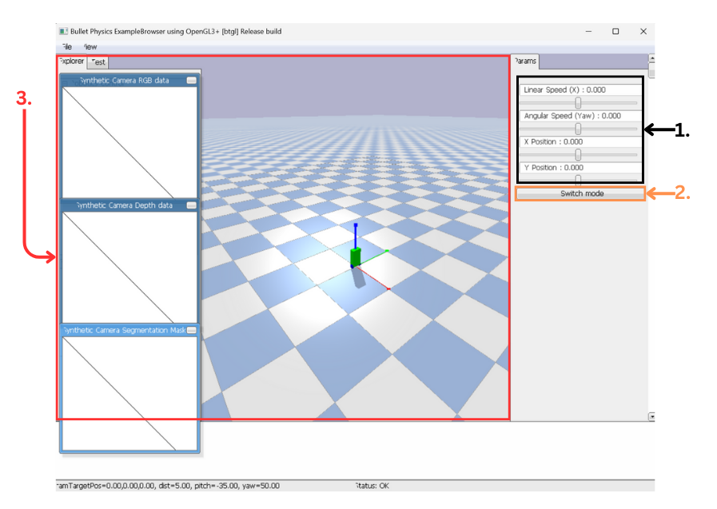
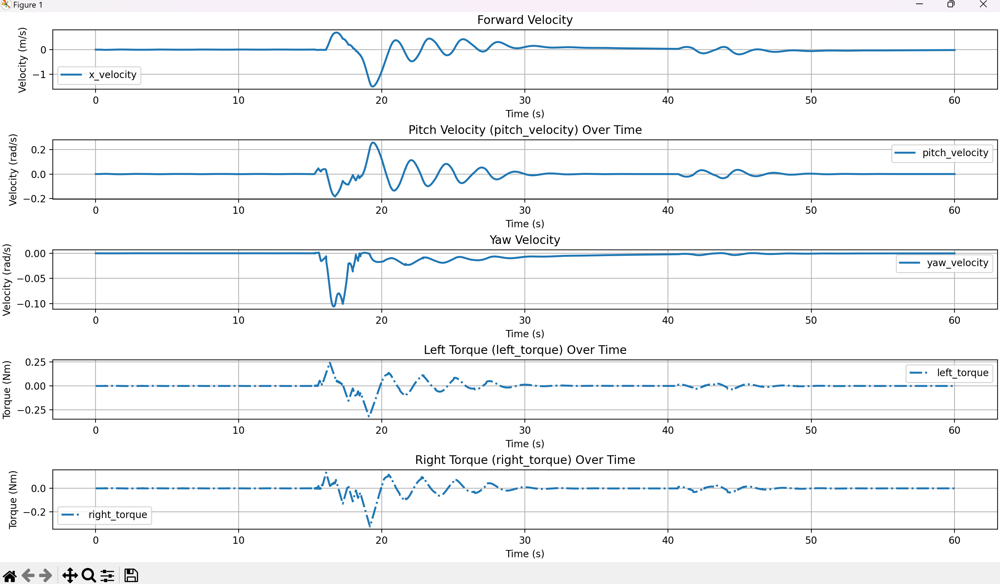
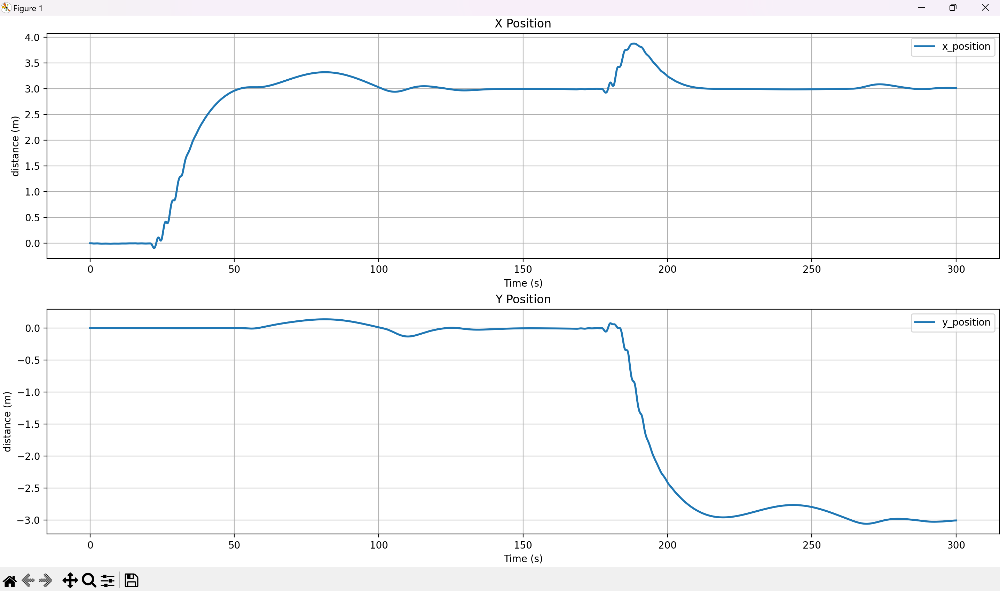
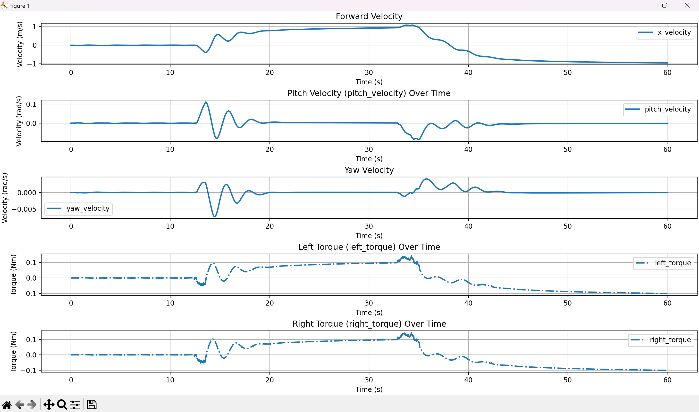
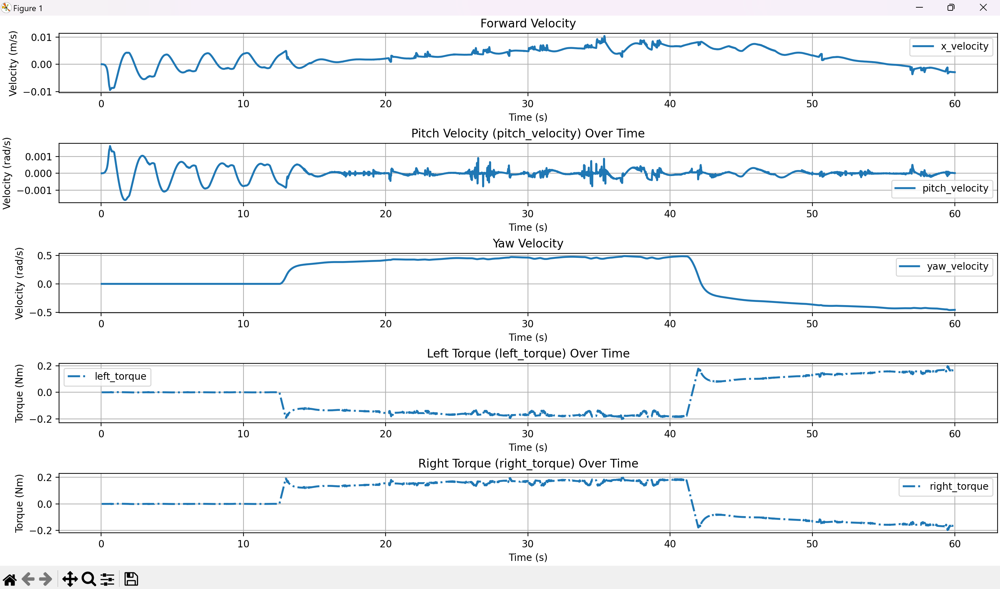
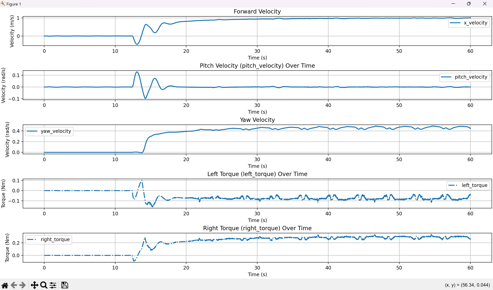
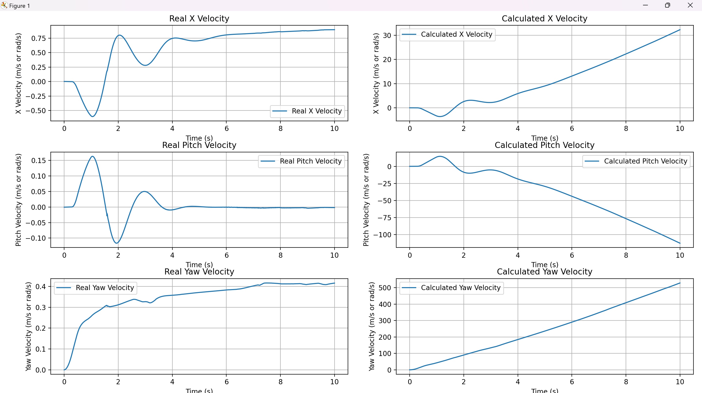
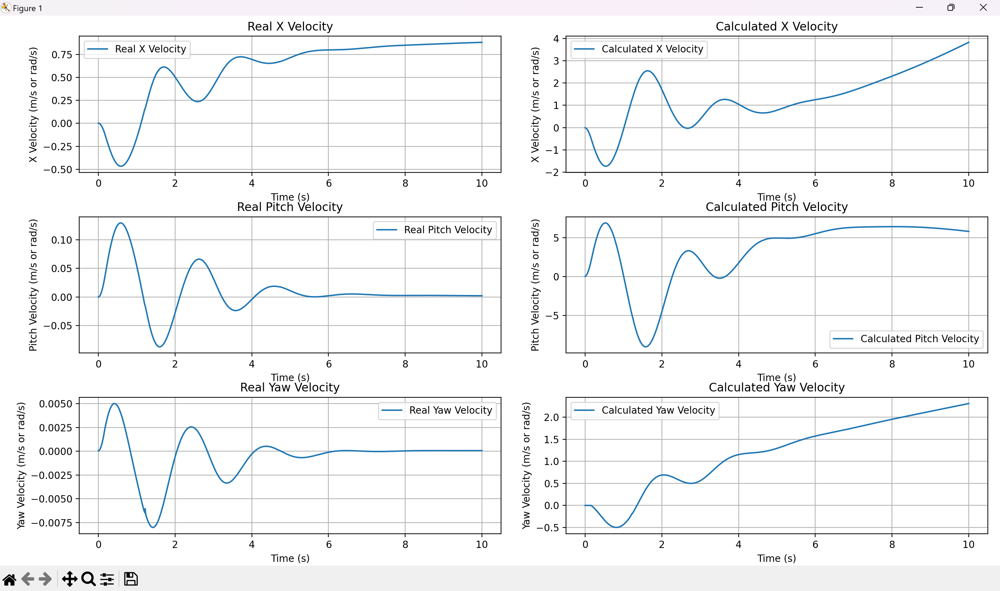

# Two-wheels self-balancing robot
- This project simulates dynamics of a two-wheels self-balancing robot, and including PID controller to maintain balance and reach the target velocity. 

# Table of content
- [**Installation**](#installation)
- [**Methodology**](#methodology)
- [**User Guide**](#userguide)
- [**Demos & Result**](#demosnresult)
- [**Conclusion**](#conclusion)
- [**Future plan**](#futureplans)
- [**References**](#references)

# Installation <a name = "installation"> </a>
1. Open Terminal
2. Copy and paste this following command
```
pip install pybullet
pip install matplotlib
```

# Methodology <a name = "methodology"> </a>
## System Modeling
The simulation involves modeling the dynamics of a Two-Wheeled Inverted Pendulum Robot (TWIP) system. The key components include:
<br>Two-Wheeled Inverted Pendulum Robot dynamics

#### Parameters
- $x$ &ensp;&emsp;: Position of robot in robot x-axis
- ${\psi}$ &emsp; : Angle of robot around z-axis
- ${\theta}$ &emsp;&nbsp; : Angle of body around wheel rotation axis
- $M_b$ &nbsp; : Mass of body
- $M_w$ &nbsp;: Mass of each wheel
- $r$ &ensp;&emsp;: Radius of wheel
- $l$ &ensp;&emsp; : Distance between body Center of mass and wheel rotation axis
- $d$ &ensp;&emsp;: Distance between 2 wheel
- $I_y$ &ensp;&ensp;: Moment inertia around body y-axis = $\frac{1}{12}M_b(width_x^{2} + width_z^{2})$
- $I_z$ &ensp;&ensp;: Moment inertia around body z-axis = $\frac{1}{12}M_b(width_y^{2} + width_z^{2})$
- $J$ &emsp; : Moment inertia around wheel rotation axis = $\frac{1}{2}M_wr^{2}$
- ${\tau_l}$ &emsp; : Torque apply to left wheel
- ${\tau_r}$ &emsp;: Torque apply to right wheel

#### Kinetic energy
Body kinetic energy

$$T = \frac{1}{2}M_b(\dot{x}^{2} + 2lcos{\theta}\dot{\theta}\dot{x} + (l\dot{\theta})^2) + \frac{1}{2}(I_y\dot{\theta}^{2} + I_z\dot{\psi}^{2} + \frac{1}{2}M_wd^{2}{\psi}^{2})$$

Wheel kinetic energy

$$T =M_w\dot{x}^2 + J(\frac{\dot{x}\pm\frac{d}{2}\dot{\psi}}{r})^2$$

#### Potential energy
$$V = mglcos{\theta}$$
#### Lagrange Method
from $L = T-V$

$$L = \frac{1}{2}(M_b+2M_w+\frac{2J}{r^2})\dot{x}^2+\frac{1}{2}(I_z+\frac{M_wd^2}{2}+\frac{Jd^2}{2r^2})\dot{\psi}^2+\frac{1}{2}(I_y+M_bl^2)\dot{\theta}^2+M_b\dot{x}\dot{\theta}lcos{\theta}-M_bglcos{\theta}$$
#### Dynamics of TWIP
from $q = [x, {\theta}, {\psi}]$
and ${\tau} = \frac{d}{dt}(\frac{\partial L}{\partial \dot{q}})-\frac{\partial L}{\partial q}$
```math
\begin{bmatrix}
   M_b+2M_w+\frac{2J}{r^2} & M_blcos{\theta} & 0 \\
   M_blcos{\theta} & I_y+M_bl^2 & 0 \\
   0 & 0 & I_z+\frac{M_wd^2}{2}+\frac{Jd^2}{2r^2}
\end{bmatrix} 
\begin{bmatrix}
    \ddot{x} \\
    \ddot{\theta} \\
    \ddot{\psi}
\end{bmatrix}+
\begin{bmatrix}
    -M_bl\dot{\theta}^2sin{\theta} \\
    0 \\
    0
\end{bmatrix} +
\begin{bmatrix}
    0 \\
    -M_bglsin{\theta}  \\
    0
\end{bmatrix} = 
\begin{bmatrix}
    {\tau_x} \\
    {\tau_{\theta}}  \\
    {\tau_{\psi}}
\end{bmatrix}
```

calculate ${\tau_x}, {\tau_{\theta}}, {\tau_{\psi}}$ in term of ${\tau_l}, {\tau_r}$
```math
\begin{bmatrix}
   M_b+2M_w+\frac{2J}{r^2} & M_blcos{\theta} & 0 \\
   M_blcos{\theta} & I_y+M_bl^2 & 0 \\
   0 & 0 & I_z+\frac{M_wd^2}{2}+\frac{Jd^2}{2r^2}
\end{bmatrix} 
\begin{bmatrix}
    \ddot{x} \\
    \ddot{\theta} \\
    \ddot{\psi}
\end{bmatrix}+
\begin{bmatrix}
    -M_bl\dot{\theta}^2sin{\theta} \\
    0 \\
    0
\end{bmatrix} +
\begin{bmatrix}
    0 \\
    -M_bglsin{\theta}  \\
    0
\end{bmatrix} = 
\begin{bmatrix}
    \frac{1}{r} & \frac{1}{r} \\
    -1 & -1 \\
    \frac{-d}{2r} & \frac{d}{2r}
\end{bmatrix}
\begin{bmatrix}
    {\tau_l} \\
    {\tau_r}
\end{bmatrix}
```


# User Guide <a name = "userguide"> </a>
1. Open File Simulation
2. Run the file
- You will see interface like this



**1. Input Zone:** Adjust Target of Position and Velocity.
**2. Switch Button:** Use to Switch Between Control Position target or Velocity Target.
>**This 2 mode is seperatly out.**

**3. Simulation Zone:** Show the simulation.

After Simulation Finish You will see Graph


**1. Forward Velocity:** Plotting linear velocity over time.

**2. Pitch Velocity:** Plotting pitch velocity over time.

**3. Yaw Velocity:** Plotting Yaw velocity around z-axis over time.

**4. Left Torque:** Plotting torque left wheel over time.

**5. Right Torque:** Plotting torque Right wheel over time.

**6. X-Position:** Plotting Position robot move in X-axis over time.

**7. Y-Position:** Plotting Position robot move in Y-axis over time.

# Demos & Result <a name = "demosnresult"> </a>
## 1. Self-Balancing
This Demo will show our robot can self-balance itself.

<video controls src="img/balance.mp4" title="Title"></video>

plotting graph to visualize.


Frist we add external force to robot from the video will see it can balance itself and from pitch graph it closed to **0 rad/s** after 30 second that mean robot balancing finish .

## 2. Linear Velocity Control
This Demo will show our robot acheive linear velocity target from input.

<video controls src="img/linear.mp4" title="Title"></video>

plotting graph to visualize.



after input target to **1 m/s** this robot use 20 second to acheive target and after change target to **-1 m/s** it use 20 second to aceive target too. 

## 3. Angular Velocity Control
This Demo will show our robot acheive yaw velocity target from input.

<video controls src="img/angular.mp4" title="Title"></video>

plotting graph to visualize.


Input Angular Velocity to **0.5 rad/s** after robot acheive target input new target to **-0.5 rad/s** from the graph will see they can acheive target too.

## 4. Linear and Angular Velocity Control
This Demo will show our robot acheive linear and angular velocity target from input.

<video controls src="img/linear and angular.mp4" title="
"></video>

plotting graph to visualize.


when input linear velocity to **1 m/s** and input Angular velocity to **0.5 rad/s** and they can acheive target both.

## 5. Position Control
This demo show robot can acheive position target in X and Y axis

<video controls src="img/position.mp4" title="
"></video>

plotting graph to visualize.


from this demo first we input target position in X-axis to **3 m** and after it closed to target we apply Y position to **-3 m** the result is robot can acheive both target. 

## 6. Compare Simulation with the equation.
To ensure the simulation is equal the equation we use this dynamics equation

```math
\begin{bmatrix}
   M_b+2M_w+\frac{2J}{r^2} & M_blcos{\theta} & 0 \\
   M_blcos{\theta} & I_y+M_bl^2 & 0 \\
   0 & 0 & I_z+\frac{M_wd^2}{2}+\frac{Jd^2}{2r^2}
\end{bmatrix} 
\begin{bmatrix}
    \ddot{x} \\
    \ddot{\theta} \\
    \ddot{\psi}
\end{bmatrix}+
\begin{bmatrix}
    -M_bl\dot{\theta}^2sin{\theta} \\
    0 \\
    0
\end{bmatrix} +
\begin{bmatrix}
    0 \\
    -M_bglsin{\theta}  \\
    0
\end{bmatrix} = 
\begin{bmatrix}
    \frac{1}{r} & \frac{1}{r} \\
    -1 & -1 \\
    \frac{-d}{2r} & \frac{d}{2r}
\end{bmatrix}
\begin{bmatrix}
    {\tau_l} \\
    {\tau_r}
\end{bmatrix}
```

demo simulation

<video controls src="img/compare.mp4" title="Title"></video>

plotting graph to visualize.

the result is calculation and simulation have some trend before 4 second. 

So we add friction term in the equation and compare again.
This is the new equation after add friction term.
```math
\begin{bmatrix}
   M_b+2M_w+\frac{2J}{r^2} & M_blcos{\theta} & 0 \\
   M_blcos{\theta} & I_y+M_bl^2 & 0 \\
   0 & 0 & I_z+\frac{M_wd^2}{2}+\frac{Jd^2}{2r^2}
\end{bmatrix} 
\begin{bmatrix}
    \ddot{x} \\
    \ddot{\theta} \\
    \ddot{\psi}
\end{bmatrix}+
\begin{bmatrix}
    -M_bl\dot{\theta}^2sin{\theta} \\
    0 \\
    0
\end{bmatrix} +
\begin{bmatrix}
    0 \\
    -M_bglsin{\theta}  \\
    0
\end{bmatrix} = 
\begin{bmatrix}
    \frac{1}{r} & \frac{1}{r} \\
    -1 & -1 \\
    \frac{-d}{2r} & \frac{d}{2r}
\end{bmatrix}
\begin{bmatrix}
    {\tau_l - f_l} \\
    {\tau_r - f_r}
\end{bmatrix}
```
this is graph after add friction term

from this graph will see it have more likely simulation but not all. That make us think this equation must to have disturbance term that come from physics engine so we can summarized this equation in this form.

```math
\begin{bmatrix}
   M_b+2M_w+\frac{2J}{r^2} & M_blcos{\theta} & 0 \\
   M_blcos{\theta} & I_y+M_bl^2 & 0 \\
   0 & 0 & I_z+\frac{M_wd^2}{2}+\frac{Jd^2}{2r^2}
\end{bmatrix} 
\begin{bmatrix}
    \ddot{x} \\
    \ddot{\theta} \\
    \ddot{\psi}
\end{bmatrix}+
\begin{bmatrix}
    -M_bl\dot{\theta}^2sin{\theta} \\
    0 \\
    0
\end{bmatrix} +
\begin{bmatrix}
    0 \\
    -M_bglsin{\theta}  \\
    0
\end{bmatrix} = 
\begin{bmatrix}
    \frac{1}{r} & \frac{1}{r} \\
    -1 & -1 \\
    \frac{-d}{2r} & \frac{d}{2r}
\end{bmatrix}
\begin{bmatrix}
    {\tau_l - f_l} \\
    {\tau_r - f_r}
\end{bmatrix} -
\begin{bmatrix}
    {\tau_{disturbance}}\\
    {\tau_{disturbance_{\theta}}}\\
    {\tau_{disturbance_{\psi}}}
\end{bmatrix}
```

# Conclusion <a name = "conclusion"> </a>

# Future plan <a name = "futureplans"> </a>

# References <a name = "references"> </a>
